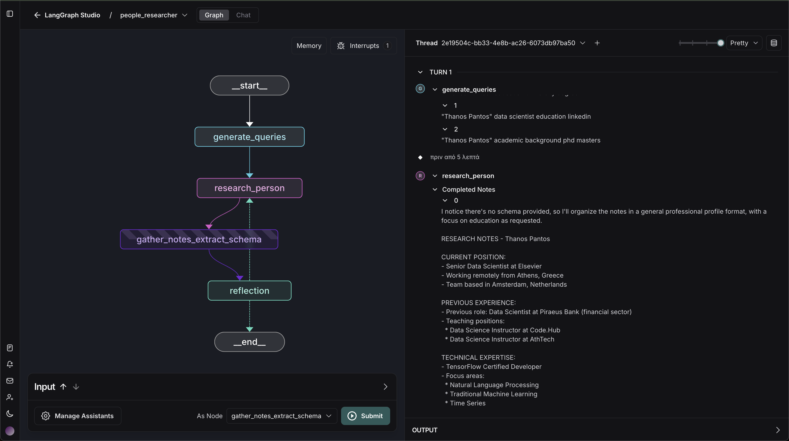

# People Researcher Agent

People Researcher Agent searches the web for information about a user-supplied person and returns it in a structured format defined by user-supplied JSON schema.




## Quickstart with LangGraph server

Set API keys for the LLM of choice (Anthropic is set by default set in `src/agent/graph.py`) and [Tavily API](https://tavily.com/):
```
cp .env.example .env
```

Clone the repository and launch the assistant [using the LangGraph server](https://langchain-ai.github.io/langgraph/cloud/reference/cli/#dev):
```bash
curl -LsSf https://astral.sh/uv/install.sh | sh
git clone https://github.com/langchain-ai/people-researcher.git
cd people-researcher
uvx --refresh --from "langgraph-cli[inmem]" --with-editable . --python 3.11 langgraph dev
```

## How it works

People Researcher Agent follows a multi-step research and extraction workflow that separates web research from schema extraction, allowing for better resource management and comprehensive data collection:

   - **Research Phase**: The system performs intelligent web research on the input person:
     - Uses an LLM to generate targeted search queries based on the schema requirements (up to `max_search_queries`)
     - Executes concurrent web searches via [Tavily API](https://tavily.com/), retrieving up to `max_search_results` results per query
     - Takes structured research notes focused on schema-relevant information
   - **Extraction Phase**: After research is complete, the system:
     - Consolidates all research notes
     - Uses an LLM to extract and format the information according to the user-defined schema
     - Returns the structured data in the exact format requested
   - **Reflection Phase**: The system evaluates the quality of extracted information:
     - Analyzes completeness of required fields
     - Identifies any missing or incomplete information
     - Generates targeted follow-up search queries if needed
     - Continues research until information is satisfactory or max reflection steps reached

## Configuration

The configuration for People Researcher Agent is defined in the `src/agent/configuration.py` file: 
* `max_search_queries`: int = 3 # Max search queries 
* `max_search_results`: int = 3 # Max search results per query
* `max_reflection_steps`: int = 1 # Max reflection steps

## Inputs 

The user inputs are: 

```
* person: a JSON object with the following fields:
    - `email` (required): The email of the person
    - `name` (optional): The name of the person
    - `company` (optional): The current company of the person
    - `linkedin` (optional): The Linkedin URL of the person
    - `role` (optional): The current title of the person
* schema: Optional[dict] - A JSON schema for the output
* user_notes: Optional[str] - Any additional notes about the people from the user
```

If a schema is not provided, the system will use a default schema (`DEFAULT_EXTRACTION_SCHEMA`) defined in `people_maistro.py`.

### Schema

> ⚠️ **WARNING:** JSON schemas require `title` and `description` fields for [extraction](https://python.langchain.com/docs/how_to/structured_output/#typeddict-or-json-schema).
> ⚠️ **WARNING:** Avoid JSON objects with nesting; LLMs have challenges performing structured extraction from nested objects. 

Here is an example schema that can be supplied to research a person:  

```
{
  "type": "object",
  "required": [
    "years_experience",
    "current_company",
    "role",
    "prior_companies"
  ],
  "properties": {
    "role": {
      "type": "string",
      "description": "Current role of the person."
    },
    "years_experience": {
      "type": "number",
      "description": "How many years of full time work experience (excluding internships) does this person have."
    },
    "current_company": {
      "type": "string",
      "description": "The name of the current company the person works at."
    },
    "prior_companies": {
      "type": "array",
      "items": {
        "type": "string"
      },
      "description": "List of previous companies where the person has worked"
    }
  },
  "description": "Person information",
  "title": "Person"
}
```
